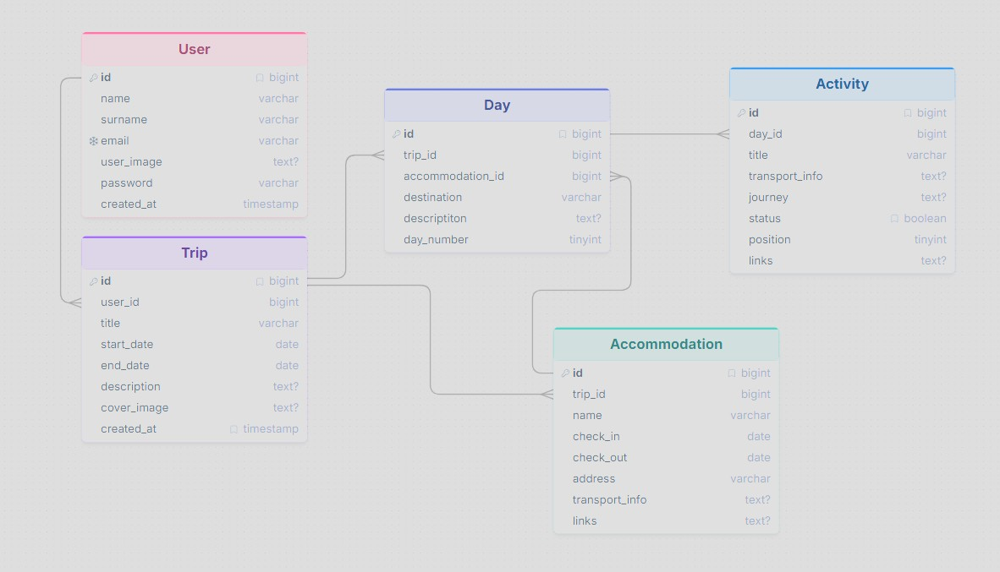

# User Stories

## Gestione viaggi

L'utente deve poter:

- Visualizzare una dashboard con tutti i propri viaggi.
- Creare un nuovo viaggio.
- Aprire il dettaglio di un viaggio.
- Modificare le informazioni di un viaggio.
- Eliminare un viaggio non più necessario.

## Pianificazione

Per ogni viaggio l'utente deve poter:

- Definire la destinazione.
- Impostare le date di partenza e ritorno.
- Organizzare il viaggio in giornate.
- Aggiungere una o più tappe per ogni giornata.
- Inserire alloggi, mezzi di trasporto e collegamenti utili.
- Aggiungere note e informazioni personali.
- Definire un budget complessivo e monitorarne l'utilizzo.

## Durante il viaggio

L'utente deve poter:

- Visualizzare l'itinerario giornaliero.
- Segnare una tappa come completata.
- Registrare le spese sostenute.
- Aggiornare note e informazioni durante il viaggio.
- Tenere traccia dello stato di avanzamento del viaggio.

## Memories

Al termine del viaggio l'utente deve poter:

- Caricare fotografie.
- Scrivere un diario o commenti personali.
- Recensire luoghi e attività.
- Valutare l'esperienza complessiva.
- Conservare il viaggio come archivio personale.

## Community

L'utente deve poter:

- Decidere se mantenere un viaggio privato o renderlo pubblico.
- Condividere il viaggio con la community.
- Esplorare i viaggi pubblicati dagli altri utenti.
- Prendere ispirazione da itinerari, recensioni e consigli condivisi.

---

# Wireframe (MVP)

## Pagina principale

- Header fisso
- Pagina di autenticazione

## Dashboard

- Elenco dei viaggi dell'utente
- Card modificabili
- Pulsante "Nuovo viaggio"

## Nuovo viaggio

- Form con:
  - Titolo
  - Destinazione
  - Data partenza
  - Data ritorno
  - Descrizione (opzionale)
  - Immagine di copertina (opzionale)
- Pulsante "Crea viaggio"

Alla conferma, l'utente viene reindirizzato alla pagina di dettaglio.

## Dettaglio viaggio

- Titolo
- Destinazione
- Date
- Descrizione
- Elenco dei giorni
- Pulsante "Aggiungi giorno"

Per ogni giorno:

- Descrizione
- Elenco attività
- Alloggio

Cliccando sul giorno si apre la lista attività, cliccando sull'attività si aprono i dettagli.

Ogni attività contiene:

- Titolo
- Descrizione
- Spostamento
- Link utili
- Stato
- Ordine

Ogni alloggio contiene:

- Nome
- Indirizzo
- Check-in
- Check-out
- Link prenotazione

- Pulsante "Salva modifiche"

## Modifica viaggio

- Modifica delle informazioni del viaggio
- Riordino delle attività
- Eliminazione di giorni e attività

# Wireframe Versione 2

- Gestione budget
- Dashboard spese
- Galleria immagini
- Recensioni

# Wireframe Versione 3

- Profilo pubblico
- Community
- Feed viaggi

---

# Domain Model

## Entità principali

### USER

Rappresenta un utente registrato della piattaforma.

Attributi principali:

- id
- nome
- cognome
- email
- immagine profilo
- password
- created_at

### TRIP

Rappresenta un viaggio creato da un utente.

Relazione:

- Un USER può avere molti TRIP.

Attributi principali:

- id
- user_id
- titolo
- data partenza
- data ritorno
- descrizione
- immagine copertina
- created_at

### DAY

Rappresenta una giornata del viaggio.

Relazione:

- Un TRIP può avere molti DAY.
- Un ACCOMMODATION può avere molti DAY.

Attributi principali:

- id
- trip_id
- accomodation_id
- destinazione
- descrizione
- numero giorno

### ACTIVITY

Rappresenta una tappa o attività durante una giornata.

Relazione:

- Un DAY può avere molte ACTIVITY.

Attributi principali:

- id
- day_id
- titolo
- info trasporto
- spostamento
- stato
- ordine
- links

### ACCOMMODATION

Rappresenta un alloggio associato al viaggio.

Relazione:

- Un ACCOMMODATION può avere più DAY.

Attributi principali:

- id
- trip_id
- nome
- check-in
- check-out
- indirizzo
- info trasporto
- links

## Relazioni

USER 1:N TRIP

TRIP 1:N DAY

TRIP 1:N ACCOMMODATION

ACCOMMODATION 1:N DAY

DAY 1:N ACTIVITY

# Database Design

Schema ER:

